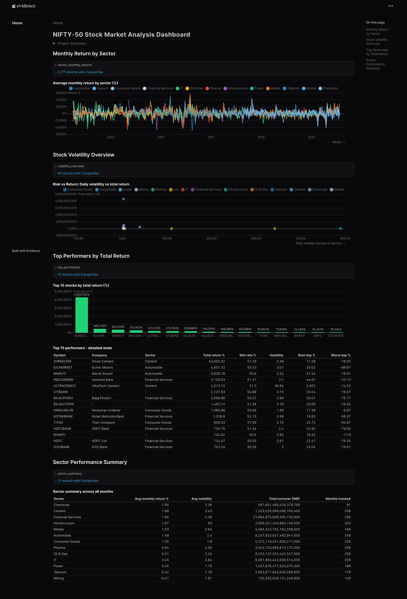
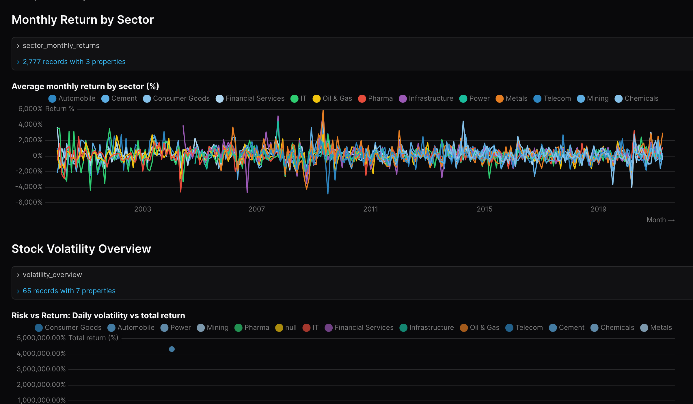
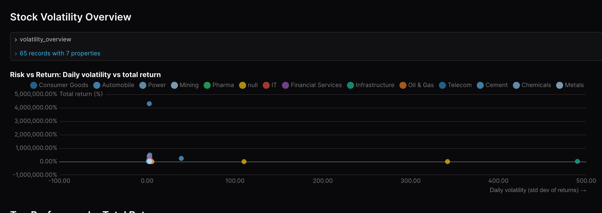
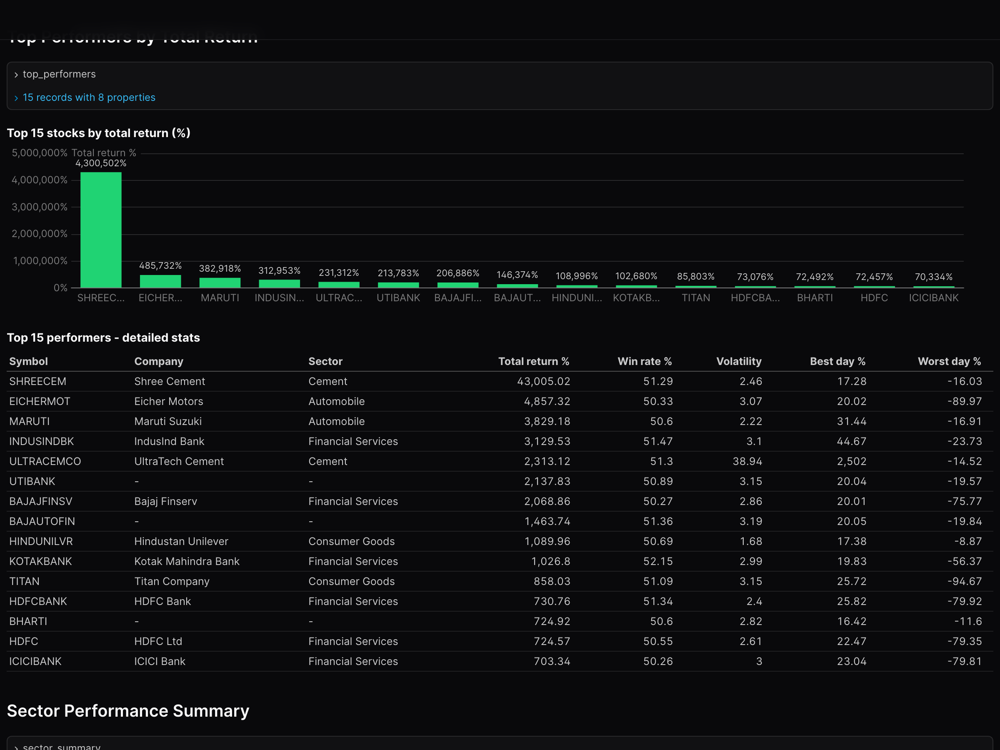
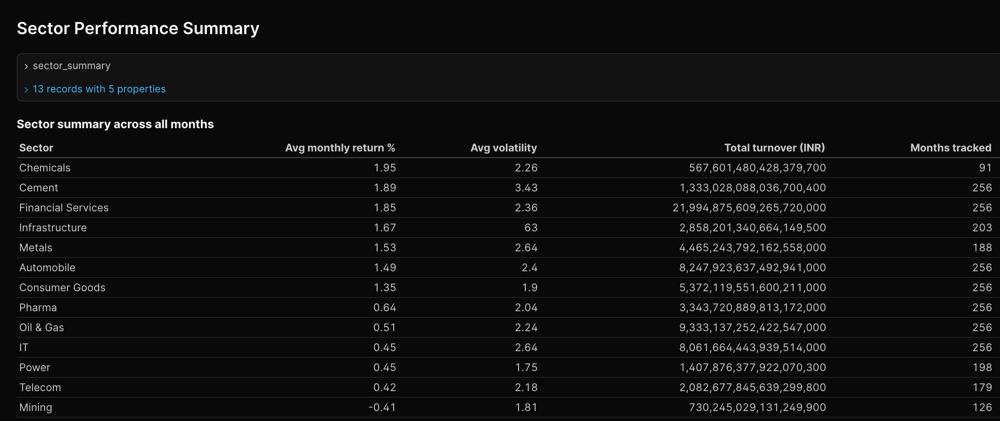

<div align="center">

# 📈 NIFTY-50 Stock Market Analysis

**An end-to-end, containerised data pipeline that ingests ~20 years of daily OHLCV data for India's NIFTY-50 constituents from Kaggle, transforms it into analysis-ready marts, and serves it through an interactive Evidence dashboard.**

   

[Report Bug](https://github.com/pritish717/nifty50-stock-analysis/issues) · [Request Feature](https://github.com/pritish717/nifty50-stock-analysis/issues)

</div>

---

## 📸 Dashboard

Built with Evidence, the dashboard surfaces sector-level returns, risk vs. return, top performers, and turnover at a glance.



<details>
<summary><b>Section views (click to expand)</b></summary>

### Monthly returns by sector — 20 years of NIFTY-50 sector performance


### Risk vs Return — daily volatility plotted against total return for every constituent


### Top performers — best 15 stocks by total return with detailed risk stats


### Sector summary — average return, volatility, and total turnover by sector


</details>

---

## 📖 About

This project takes Rohan Rao's [NIFTY-50 stock market dataset on Kaggle](https://www.kaggle.com/datasets/rohanrao/nifty50-stock-market-data) — daily OHLCV records for the 50 largest publicly listed Indian companies spanning roughly two decades — and turns it into a self-contained analytical product anyone can reproduce with two commands.

The raw dataset is 52 separate CSVs with inconsistent date ranges, mixed schemas, and no sector context. The pipeline normalises all of that into clean staging views, layers on a sector dimension via a dbt seed, builds intermediate per-day metrics (returns, deliveries, turnover), and finally publishes three analytical marts that power the dashboard:

- **`mart_monthly_performance`** — per-stock, per-month returns, volume, turnover, delivery%
- **`mart_sector_analysis`** — sector-level aggregates with best/worst stock per month
- **`mart_stock_volatility`** — lifetime volatility, win rate, drawdowns, and total return per stock

Every step — ingestion, dbt build, dashboard serving — runs inside Docker, orchestrated by Prefect, so a fresh clone goes from zero to a live dashboard in a single `make project` invocation.

### Pipeline steps

1. **Ingest** — `python_scripts/ingest.py` downloads the Kaggle archive via the official Kaggle API, unzips it, normalises 52 stock CSVs into one partitioned Parquet file, and registers it as a DuckDB view in the `raw` schema.
2. **Transform** — dbt builds the warehouse using the medallion architecture: staging views → intermediate views → analytical marts (materialised as tables) inside a single `warehouse.duckdb` file.
3. **Test** — dbt tests run against staging models (uniqueness, not-null) before downstream steps depend on them.
4. **Visualise** — Evidence reads the same DuckDB warehouse and renders the dashboard at `localhost:3000`.
5. **Orchestrate** — Prefect supervises the entire flow with retries and a UI at `localhost:4200` for run history and observability.

---

## ✨ Features

- **One-command setup** — `make project KAGGLE_USERNAME=… KAGGLE_KEY=…` builds, ingests, transforms, tests, and serves end-to-end.
- **Reproducible by design** — entirely containerised, no Python or Node required on the host beyond Docker.
- **Observable** — Prefect server included; every task run is logged and retryable.
- **Tested** — dbt schema tests guard staging models; failures stop the pipeline before they corrupt downstream marts.
- **Extensible** — add a new mart in `dbt-project/models/marts/`, expose it as an Evidence source, and reference it from a markdown page. That's it.
- **Beautiful dashboard** — Evidence combines Markdown and SQL so the dashboard is also self-documenting analysis.

---

## 🛠️ Built With

| Category | Technology |
|---|---|
| Data Ingestion | Python + Kaggle API |
| Orchestration | Prefect 3 |
| Data Transformation | dbt + dbt-duckdb |
| Warehouse | DuckDB |
| Visualisation | Evidence |
| Containerisation | Docker + Docker Compose |
| Build automation | GNU Make |

---

## 🏗️ Architecture

```
┌────────────────┐    ┌──────────────────┐    ┌──────────────────────┐
│  Kaggle API    │───▶│  python_scripts  │───▶│  data/processed/     │
│  (NIFTY-50)    │    │  (extract+load)  │    │  stock_prices.parquet│
└────────────────┘    └──────────────────┘    └──────────┬───────────┘
                                                          │
                                                          ▼
                       ┌──────────────────────────────────────────────┐
                       │            DuckDB warehouse.duckdb           │
                       │                                              │
                       │  raw  ──▶  staging  ──▶  intermediate  ──▶   │
                       │                                  marts       │
                       └────────────────────┬─────────────────────────┘
                                            │
                          ┌─────────────────┼─────────────────┐
                          ▼                 ▼                 ▼
                  ┌────────────┐    ┌────────────┐    ┌──────────────┐
                  │  dbt tests │    │  Evidence  │    │   Prefect    │
                  │            │    │  dashboard │    │    server    │
                  │            │    │   :3000    │    │     :4200    │
                  └────────────┘    └────────────┘    └──────────────┘
```

Everything inside the dashed warehouse box runs inside the `pipeline` container; the Evidence and Prefect services run as their own containers in the same Compose network.

---

## 🚀 Getting Started

### Prerequisites

- **[Docker Desktop](https://www.docker.com/products/docker-desktop/)** (with Docker Compose v2)
- **A Kaggle account** with an API token. If you've ever downloaded a Kaggle dataset via the CLI, you already have `~/.kaggle/kaggle.json` — that's all you need.
  - Don't have one? Sign in on [kaggle.com](https://www.kaggle.com), go to **Account → API → Create New Token**, and a `kaggle.json` will download. Move it to `~/.kaggle/kaggle.json` and `chmod 600` it.

### Installation

1. **Clone the repository**

    ```bash
    git clone https://github.com/pritish717/nifty50-stock-analysis.git
    cd nifty50-stock-analysis
    ```

2. **Run the project**

    > [!NOTE]
    > The first run takes ~3–5 minutes (Docker image builds + npm install for Evidence + dataset download). Subsequent runs reuse layers and complete in seconds.

    If your Kaggle credentials live at `~/.kaggle/kaggle.json` (the standard location), use this one-liner — it extracts them with `jq` and passes them to make:

    ```bash
    make project \
      KAGGLE_USERNAME=$(jq -r .username ~/.kaggle/kaggle.json) \
      KAGGLE_KEY=$(jq -r .key ~/.kaggle/kaggle.json)
    ```

    Or, if you'd rather pass them directly:

    ```bash
    make project KAGGLE_USERNAME=your_username KAGGLE_KEY=your_api_key
    ```

3. **Open the dashboard**

    > Evidence takes ~30–60 seconds after the pipeline finishes to compile and serve. If you see a blank page, give it a moment and refresh.

    ```bash
    make dashboard       # opens http://localhost:3000
    ```

4. **Open the Prefect UI** (optional — to inspect flow runs)

    ```bash
    make prefect-server  # opens http://localhost:4200
    ```

### Useful commands

| Command | What it does |
|---|---|
| `make project` | Full build + ingest + transform + test + serve dashboard |
| `make pipeline` | Re-run only the ingest + dbt pipeline (dashboard keeps using fresh data) |
| `make dashboard` | Open the Evidence dashboard in your default browser |
| `make prefect-server` | Open the Prefect UI |
| `make down` | Stop all containers (preserves data) |
| `make clean` | Stop and remove all containers + volumes (full reset) |

---

## 📂 Project Structure

```
nifty50-stock-analysis/
├── pipeline.py                  # Prefect flow: ingest → dbt debug/seed/run/test
├── python_scripts/
│   ├── ingest.py                # Entry point used by Prefect ingest task
│   └── extract.py               # Kaggle download + Parquet conversion + DuckDB load
├── dbt-project/
│   ├── models/
│   │   ├── staging/             # 1:1 cleaned views over raw tables
│   │   ├── intermediate/        # Per-day derived metrics (returns, deliveries)
│   │   └── marts/               # Analytical tables consumed by Evidence
│   ├── seeds/
│   │   └── nifty50_sectors.csv  # Stock → sector dimension
│   ├── macros/                  # Reusable SQL helpers
│   └── profiles.yml             # Points dbt at /app/data/warehouse.duckdb
├── evidence/
│   ├── pages/index.md           # The dashboard (Markdown + SQL + Svelte components)
│   ├── sources/warehouse/       # Evidence ↔ DuckDB connection + per-mart SQL
│   └── Dockerfile               # Node 18 + Evidence dev server
├── docker-compose.yaml          # Three services: prefect-server, pipeline, evidence
├── Dockerfile                   # Pipeline container (Python 3.11 + dbt + Prefect)
└── makefile                     # One-command orchestration
```

---

## 🗺️ Roadmap

This is a feature-complete v1 covering the full ingest → transform → visualise loop. Next on the list:

- **Incremental ingestion** — append new daily bars from a live source (e.g. NSE) instead of re-downloading the full Kaggle archive.
- **More dbt tests** — `accepted_values` on sectors, `relationships` from marts to staging, freshness checks on raw.
- **Schedule the flow** — register the Prefect deployment so it runs on a daily cron and notifies on failure.
- **More marts** — drawdown analysis, rolling Sharpe, sector rotation signals.
- **CI** — GitHub Actions to lint dbt models and smoke-test the pipeline on every PR.
- **Cloud-friendly variant** — swap DuckDB for Motherduck so the same project can run against a hosted warehouse with no other code changes.

---

## 🤝 Contributing

Contributions are welcome! If you spot a bug, want to add a chart, or have an idea for a new mart:

1. Fork the repository
2. Create a feature branch (`git checkout -b feature/amazing-feature`)
3. Commit your changes (`git commit -m 'Add amazing feature'`)
4. Push to the branch (`git push origin feature/amazing-feature`)
5. Open a Pull Request

---

## 📄 License

Distributed under the MIT License. See `LICENSE` for details.

---

## 👤 Author

**Pritish Chaudhary**

- GitHub: [@pritish717](https://github.com/pritish717)
- Email: [pritish717@gmail.com](mailto:pritish717@gmail.com)

---

## 🙏 Acknowledgements

- [Rohan Rao](https://www.kaggle.com/rohanrao) for curating and publishing the [NIFTY-50 dataset](https://www.kaggle.com/datasets/rohanrao/nifty50-stock-market-data) that this project depends on.
- The teams behind [DuckDB](https://duckdb.org/), [dbt](https://www.getdbt.com/), [Prefect](https://www.prefect.io/), and [Evidence](https://evidence.dev/) for building tools that make a project like this possible in a weekend.

---

<div align="center"><sub>Built with ❤️ by <a href="https://github.com/pritish717">Pritish</a></sub></div>
